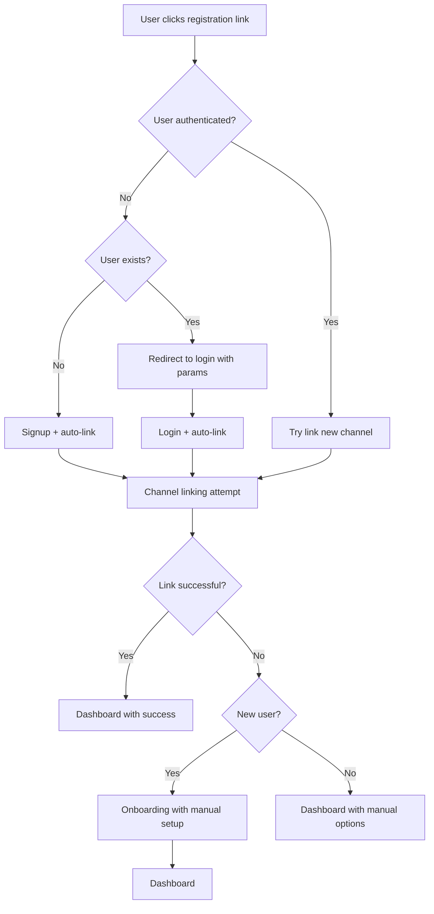
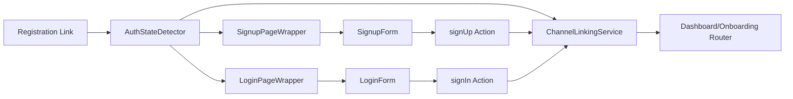

# Design Document

## Overview

The Enhanced Registration and Channel Linking system addresses complex authentication flows when users receive registration links from chatbots. The system intelligently handles three distinct user states: new users, existing logged-in users, and existing logged-out users, while preserving channel linking parameters throughout the authentication flow.

## Architecture

### High-Level Flow



### Component Architecture



## User Flow Scenarios

### Scenario 1: New User from Chat Link
1. User clicks registration link from chatbot
2. System detects no authentication + user doesn't exist
3. User completes signup form
4. System attempts automatic channel linking
5. **Success**: Skip onboarding → Dashboard with success message
6. **Failure**: Show onboarding with error context and manual linking options

### Scenario 2: Existing Logged-In User from Chat Link
1. User clicks registration link from chatbot
2. System detects existing authentication
3. System attempts to link new channel to existing account
4. **Success**: Dashboard with confirmation of new channel
5. **Failure**: Dashboard with manual linking options
6. **Already Linked**: Dashboard with informative message

### Scenario 3: Existing Logged-Out User from Chat Link
1. User clicks registration link from chatbot
2. System detects no authentication but user exists
3. System redirects to login with preserved channel parameters
4. User completes login
5. System attempts automatic channel linking
6. **Success**: Dashboard with confirmation
7. **Failure**: Dashboard with manual linking options

### Scenario 4: User Navigation Between Forms
1. User starts on signup but realizes they have an account
2. Clicks "Sign In" link
3. System preserves channel parameters in URL
4. User completes login with automatic channel linking

## Components and Interfaces

### 1. AuthStateDetector Component

A new component that determines user authentication state and routes accordingly.

```typescript
interface AuthStateDetectorProps {
  searchParams: {
    link?: string;
    channel?: string;
    message?: string;
  };
}

interface AuthState {
  isAuthenticated: boolean;
  isLoading: boolean;
  user: User | null;
  userExists: boolean; // New property to track if user exists but is logged out
}
```

### 2. Enhanced SignupPageWrapper

Extended to handle user existence detection and routing.

```typescript
interface EnhancedSignupPageWrapperProps {
  message?: string | null;
  link?: string | null;
  channel?: string | null;
}

// New methods
- detectUserExistence(email: string): Promise<boolean>
- handleExistingUserRedirect(params: URLSearchParams): void
- preserveChannelParams(targetPath: string, params: URLSearchParams): string
```

### 3. Enhanced LoginForm

Extended to handle automatic channel linking after successful authentication.

```typescript
interface EnhancedLoginFormProps {
  message?: string | null;
  link?: string | null;
  channel?: string | null;
  autoLinkChannel?: boolean; // New prop for auto-linking
}
```

### 4. ChannelLinkingService

A new service to handle channel linking operations across different flows.

```typescript
interface ChannelLinkingService {
  validateAndLinkChannel(userId: string, nonce: string, channelId: string): Promise<LinkResult>;
  handleLinkingErrors(error: Error, context: string): void;
  isLinkExpired(nonce: string): Promise<boolean>;
  generateFallbackLinkingOptions(channelId: string): LinkingOption[];
}

interface LinkResult {
  success: boolean;
  error?: string;
  requiresManualSetup?: boolean;
  fallbackOptions?: LinkingOption[];
}
```

### 5. Enhanced Auth Actions

Extended server actions to handle different authentication scenarios.

```typescript
// Enhanced signUp action
interface EnhancedSignUpData extends SignupFormData {
  channel?: string;
  link?: string;
  userExistsOverride?: boolean; // For handling edge cases
  skipOnboarding?: boolean; // Skip onboarding when channel is auto-linked
}

// Enhanced signIn action  
interface EnhancedSignInData extends SignInFormData {
  channel?: string;
  link?: string;
  autoLinkChannel?: boolean;
}

// Enhanced redirect logic
interface RedirectDecision {
  path: string;
  skipOnboarding: boolean;
  channelLinked: boolean;
  preserveParams: boolean;
}
```

## Data Models

### Enhanced Channel Verification

```typescript
interface ChannelVerification {
  id: string;
  user_id: string | null; // null for registration links
  channel_id: string;
  nonce: string;
  expires_at: string;
  user_handle: string;
  chat_metadata: Record<string, any>;
  created_at: string;
  verified_at: string | null;
  // New fields
  link_type: 'registration' | 'channel_addition';
  original_user_email?: string; // For tracking duplicate attempts
  fallback_attempted: boolean;
}
```

### User State Tracking

```typescript
interface UserAuthState {
  userId?: string;
  isAuthenticated: boolean;
  userExists: boolean;
  hasChannelParams: boolean;
  channelLinkingRequired: boolean;
  redirectPath?: string;
  shouldSkipOnboarding: boolean; // New field for chat-based signups
}
```

## Error Handling

### Error Categories

1. **Authentication Errors**
   - User already exists (signup attempt)
   - Invalid credentials (login attempt)
   - Session expired
   - Account locked/suspended

2. **Channel Linking Errors**
   - Expired nonce
   - Invalid channel parameters
   - Channel already linked
   - Network/API errors

3. **Flow State Errors**
   - Missing required parameters
   - Invalid state transitions
   - Concurrent modification conflicts

### Error Recovery Strategies

```typescript
interface ErrorRecoveryStrategy {
  errorType: string;
  recoveryActions: RecoveryAction[];
  fallbackOptions: FallbackOption[];
  userMessage: string;
  technicalDetails?: string;
}

interface RecoveryAction {
  type: 'retry' | 'redirect' | 'manual_setup' | 'contact_support';
  label: string;
  action: () => Promise<void>;
}
```

### Logging Strategy

```typescript
interface AuthFlowLog {
  timestamp: string;
  userId?: string;
  sessionId: string;
  flowType: 'new_user' | 'existing_logged_in' | 'existing_logged_out';
  step: string;
  success: boolean;
  error?: string;
  channelParams?: {
    channel: string;
    nonce: string;
    linkType: string;
  };
  userAgent: string;
  ipAddress: string;
}
```

## Testing Strategy

### Unit Tests

1. **AuthStateDetector Tests**
   - User state detection accuracy
   - Parameter preservation
   - Error handling

2. **ChannelLinkingService Tests**
   - Link validation
   - Expiration handling
   - Error scenarios

3. **Enhanced Auth Actions Tests**
   - Different user state scenarios
   - Parameter handling
   - Error conditions

### Integration Tests

1. **Complete Flow Tests**
   - New user registration with channel linking
   - Existing user login with channel addition
   - Error recovery flows

2. **Edge Case Tests**
   - Expired links
   - Concurrent sessions
   - Network failures

### End-to-End Tests

1. **User Journey Tests**
   - Complete registration flow from chatbot link
   - Channel addition for existing users
   - Error recovery user experience

2. **Cross-Browser Tests**
   - Parameter preservation across redirects
   - Session handling
   - Error display consistency

## Onboarding Skip Logic

### Decision Matrix

The system determines the user flow based on authentication state and channel linking results:

| User State | Channel Params | Link Valid | Channel Link Result | Final Destination | Onboarding | Additional Actions |
|------------|----------------|------------|-------------------|------------------|------------|-------------------|
| New User | ✅ | ✅ | ✅ Success | Dashboard | ❌ Skip | Show success message |
| New User | ✅ | ✅ | ❌ Failed | Onboarding | ✅ Required | Show error + manual options |
| New User | ✅ | ❌ Expired | N/A | Onboarding | ✅ Required | Show expired link message |
| New User | ❌ | N/A | N/A | Onboarding | ✅ Required | Standard flow |
| Existing (Logged In) | ✅ | ✅ | ✅ Success | Dashboard | N/A | Show new channel confirmation |
| Existing (Logged In) | ✅ | ✅ | ❌ Failed | Dashboard | N/A | Show manual linking options |
| Existing (Logged In) | ✅ | ✅ | ⚠️ Already Linked | Dashboard | N/A | Show "already connected" message |
| Existing (Logged Out) | ✅ | ✅ | ✅ Success | Dashboard | N/A | Show success after login |
| Existing (Logged Out) | ✅ | ✅ | ❌ Failed | Dashboard | N/A | Show manual options after login |
| Existing (Logged Out) | ✅ | ❌ Expired | N/A | Dashboard | N/A | Show expired link message |

### Implementation Logic

```typescript
interface OnboardingDecision {
  skipOnboarding: boolean;
  redirectPath: string;
  showChannelLinkingError?: boolean;
  fallbackOptions?: LinkingOption[];
}

function determineOnboardingFlow(
  hasChannelParams: boolean,
  channelLinkingResult: LinkResult,
  isNewUser: boolean
): OnboardingDecision {
  // Chat-based signup with successful channel linking
  if (hasChannelParams && channelLinkingResult.success && isNewUser) {
    return {
      skipOnboarding: true,
      redirectPath: '/dashboard'
    };
  }
  
  // Chat-based signup with failed channel linking
  if (hasChannelParams && !channelLinkingResult.success && isNewUser) {
    return {
      skipOnboarding: false,
      redirectPath: '/signup/complete',
      showChannelLinkingError: true,
      fallbackOptions: channelLinkingResult.fallbackOptions
    };
  }
  
  // Standard website signup
  if (!hasChannelParams && isNewUser) {
    return {
      skipOnboarding: false,
      redirectPath: '/signup/complete'
    };
  }
  
  // Existing user scenarios always go to dashboard
  return {
    skipOnboarding: true,
    redirectPath: '/dashboard',
    showChannelLinkingError: !channelLinkingResult.success,
    fallbackOptions: channelLinkingResult.fallbackOptions
  };
}
```

## Implementation Phases

### Phase 1: Core Infrastructure
- AuthStateDetector component
- Enhanced parameter preservation
- Basic error handling
- Onboarding skip logic for chat signups

### Phase 2: User Flow Enhancements
- Enhanced SignupPageWrapper with user existence detection
- Enhanced LoginForm with auto-linking
- ChannelLinkingService
- Smart redirect logic (dashboard vs onboarding)

### Phase 3: Error Handling & Recovery
- Comprehensive error handling
- Fallback options for failed channel linking
- User feedback improvements
- Graceful degradation to manual setup

### Phase 4: Testing & Optimization
- Complete test suite covering all user flows
- Performance optimization
- Analytics integration
- A/B testing for conversion rates

## Security Considerations

### Parameter Validation
- Strict nonce validation
- Channel ID sanitization
- Expiration enforcement

### Session Security
- Secure parameter passing
- CSRF protection
- Session fixation prevention

### Data Privacy
- Minimal logging of sensitive data
- Secure error messages
- PII protection in logs

## Performance Considerations

### Optimization Strategies
- Efficient user existence checks
- Cached channel validation
- Minimal database queries

### Monitoring
- Flow completion rates
- Error frequency tracking
- Performance metrics

## Accessibility

### WCAG Compliance
- Screen reader support for flow states
- Keyboard navigation
- Clear error messaging
- Focus management during redirects