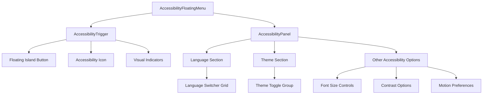
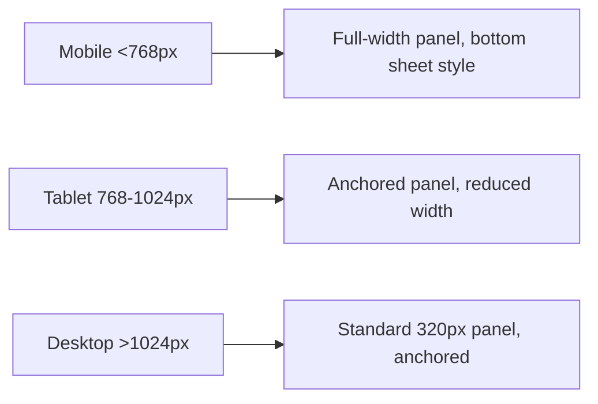
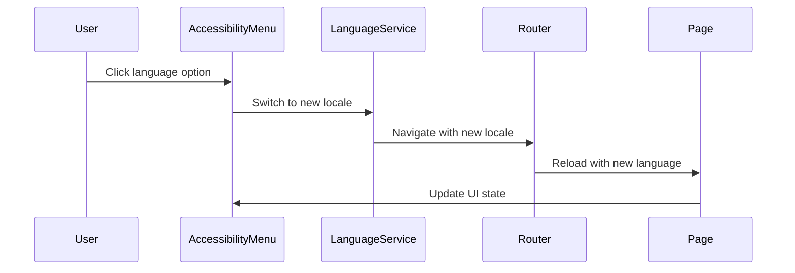
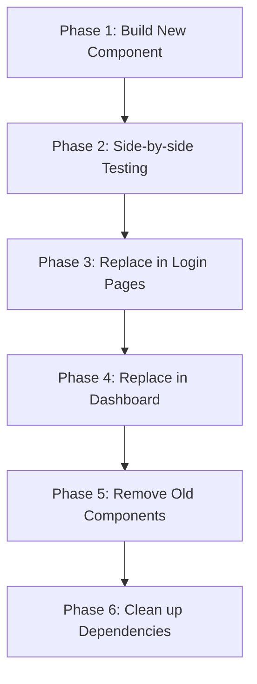

# Accessibility Floating Menu Design

## Overview

This design outlines the replacement of the current language and theme controls with a dedicated accessibility floating menu. The new system will provide a more inclusive and discoverable way for users to adjust accessibility settings, including language preferences and theme selection, through a floating island positioned in the bottom-right corner of the screen.

## Technology Stack & Dependencies

- **React 19.1.0** with TypeScript for component development
- **Next.js 15.3.5** App Router for routing and SSR
- **Tailwind CSS** for styling and responsive design
- **Radix UI** for accessible primitives (Dialog, Button, Switch)
- **Lucide React** for icons
- **Framer Motion** for smooth animations and transitions
- **next-intl** for internationalization support
- **next-themes** for theme management

## Component Architecture

### Component Definition

The accessibility floating menu system consists of three main components:

```
AccessibilityFloatingMenu/
├── AccessibilityTrigger.tsx     # Floating island trigger button
├── AccessibilityPanel.tsx       # Modal/popover panel content
└── index.tsx                    # Main orchestrator component
```

### Component Hierarchy



### Props/State Management

#### AccessibilityFloatingMenu Props
```typescript
interface AccessibilityFloatingMenuProps {
  position?: 'bottom-right' | 'bottom-left' | 'top-right' | 'top-left'
  className?: string
  showOnPages?: 'all' | 'login' | 'dashboard' | string[]
  features?: AccessibilityFeature[]
}

interface AccessibilityFeature {
  id: string
  enabled: boolean
  priority: number
}
```

#### Internal State Structure
```typescript
interface AccessibilityState {
  isOpen: boolean
  currentLanguage: Locale
  currentTheme: 'light' | 'dark' | 'system'
  fontSize: 'small' | 'medium' | 'large'
  highContrast: boolean
  reducedMotion: boolean
}
```

### Lifecycle Methods/Hooks

The component utilizes several React hooks:

- **useState** for panel open/close state
- **useLocale** from next-intl for current language
- **useTheme** from next-themes for theme state
- **useRouter** for navigation after language changes
- **useKeyboardShortcuts** for keyboard accessibility
- **useFocusTrap** for modal focus management
- **useLocalStorage** for persisting accessibility preferences

## Styling Strategy

### Design System Integration

The floating menu follows the existing design system:

- Uses CSS custom properties for consistent theming
- Leverages Tailwind utility classes for responsive design
- Implements Radix UI primitives for accessibility compliance
- Follows existing component patterns for visual consistency

### Visual Design Specifications

#### Floating Island (Trigger)
- **Size**: 56px × 56px circular button
- **Position**: Fixed bottom-right, 24px from edges
- **Background**: Semi-transparent with backdrop blur
- **Shadow**: Elevated shadow with subtle glow
- **Icon**: Universal accessibility symbol
- **States**: Default, hover, active, focus

#### Accessibility Panel
- **Size**: 320px width, auto height (max 480px)
- **Position**: Anchored to trigger button
- **Background**: Card background with border
- **Animation**: Slide-up with fade-in (respecting motion preferences)
- **Layout**: Vertical sections with clear separation

### Responsive Behavior



## State Management

### Local State Pattern

The component manages its state locally using React hooks:

```typescript
const useAccessibilityMenu = () => {
  const [isOpen, setIsOpen] = useState(false)
  const [preferences, setPreferences] = useLocalStorage('accessibility-prefs', defaultPrefs)
  
  // State synchronization with global providers
  const { theme, setTheme } = useTheme()
  const locale = useLocale()
  const router = useRouter()
  
  return {
    isOpen,
    setIsOpen,
    preferences,
    updatePreference,
    applyChanges
  }
}
```

### Integration with Existing Systems

The new component integrates with existing state management:

- **Theme State**: Synchronizes with existing `next-themes` provider
- **Language State**: Works with `next-intl` locale system
- **Router State**: Uses Next.js router for language switching
- **Persistence**: Stores preferences in localStorage

## API Integration Layer

### Language Switching Integration

```typescript
interface LanguageSwitchService {
  getCurrentLocale(): Locale
  getSupportedLocales(): Locale[]
  switchLanguage(locale: Locale): Promise<void>
  getLanguageDisplayName(locale: Locale): string
}
```

### Theme Management Integration

```typescript
interface ThemeService {
  getCurrentTheme(): Theme
  setTheme(theme: Theme): void
  getSystemTheme(): 'light' | 'dark'
  supportedThemes: Theme[]
}
```

## Routing & Navigation

### URL Handling for Language Changes

The component handles language switching by:

1. Detecting current pathname and locale
2. Constructing new URL with target locale
3. Using Next.js router to navigate
4. Preserving query parameters and hash

### Navigation Flow



## Testing Strategy

### Unit Testing Approach

- **Component Testing**: Jest + Testing Library for component behavior
- **Hook Testing**: Custom hook testing with renderHook
- **State Testing**: Test state transitions and persistence
- **Integration Testing**: Test with theme and locale providers

### Accessibility Testing

- **Screen Reader Testing**: NVDA, JAWS, VoiceOver compatibility
- **Keyboard Navigation**: Tab order, focus management, escape handling
- **ARIA Compliance**: Proper labels, roles, and states
- **Color Contrast**: WCAG AA compliance verification

### Test Cases

```typescript
describe('AccessibilityFloatingMenu', () => {
  it('should be keyboard accessible')
  it('should announce changes to screen readers')
  it('should persist user preferences')
  it('should respect reduced motion preferences')
  it('should handle theme changes correctly')
  it('should switch languages without losing context')
  it('should maintain focus management in modal')
})
```

## Migration Strategy

### Replacement of Current Components

The migration involves:

1. **Removing existing controls** from `GlobalControls.tsx`
2. **Updating layout components** that use current controls
3. **Adding new floating menu** to root layout
4. **Preserving existing functionality** during transition

### Migration Steps



### Backward Compatibility

- Maintain existing keyboard shortcuts during transition
- Preserve theme and language preferences
- Ensure no breaking changes to existing APIs
- Gradual rollout with feature flags if needed

## Implementation Considerations

### Performance Optimization

- **Lazy Loading**: Panel content loaded only when first opened
- **Memoization**: Prevent unnecessary re-renders
- **Debounced Preferences**: Batch preference updates
- **Bundle Splitting**: Separate chunk for accessibility features

### Security Considerations

- **XSS Prevention**: Sanitize user preference inputs
- **CSRF Protection**: Secure preference persistence
- **Privacy**: Local storage for sensitive preferences
- **Content Security Policy**: Inline styles compliance

### Browser Compatibility

- **Modern Browser Support**: ES2020+ features
- **Graceful Degradation**: Fallback for older browsers
- **Progressive Enhancement**: Core functionality without JavaScript
- **Touch Device Support**: Proper touch targets and gestures

## Accessibility Features

### WCAG Compliance

The floating menu implements WCAG 2.1 AA standards:

- **Perceivable**: High contrast options, scalable fonts
- **Operable**: Keyboard navigation, sufficient touch targets
- **Understandable**: Clear labels, predictable interactions
- **Robust**: Screen reader compatibility, semantic markup

### Keyboard Navigation

- **Tab Order**: Logical focus sequence
- **Escape Key**: Close menu from any focused element
- **Arrow Keys**: Navigate between options within sections
- **Enter/Space**: Activate buttons and toggles
- **Global Shortcut**: Alt+A to open accessibility menu

### Screen Reader Support

- **ARIA Labels**: Descriptive labels for all interactive elements
- **Live Regions**: Announce preference changes
- **Landmark Roles**: Proper document structure
- **State Announcements**: Current theme and language states


