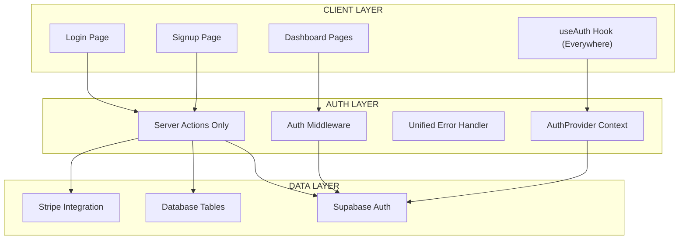

# 🏗️ PIANO DI REFACTORING AUTH - DETTAGLIATO E IMPLEMENTABILE

## 📊 ANALISI SITUAZIONE ATTUALE

### ❌ PROBLEMI CRITICI IDENTIFICATI

#### 1. **TRIPLA DUPLICAZIONE SIGNUP** (~600 LOC duplicato)
- **`src/lib/auth/actions.ts`** (185 LOC): Server Action consolidata, robusta
- **`src/app/(login)/actions.ts`** (117 LOC): Server Action básica, senza validazione
- **`src/app/api/auth/signup/route.ts`** (147 LOC): API Route duplicata

#### 2. **PATTERN MISTI INCONSISTENTI**
- **Login**: Server Actions (`signIn`)
- **Signup**: Pattern misti (Server Actions + API Routes + fetch client-side)
- **Forms**: `SignupForm.tsx` usa fetch API invece di `useFormState`

#### 3. **AUTH CHECKING FRAMMENTATO**
- **Middleware**: `getClaims()`
- **Pages**: `getClaims()` manuale
- **Components**: mix di approcci

#### 4. **useAuth HOOK INUTILIZZATO**
- Hook robusto con real-time updates, error handling completo
- Zero utilizzo nell'applicazione
- Check auth tutti manuali

#### 5. **MIDDLEWARE DUPLICATO**
- `middleware.ts` e `src/lib/db/middleware.ts` praticamente identici

#### 6. **ERROR HANDLING FRAMMENTATO**
- Server Actions: `FormState` structured
- API Routes: `NextResponse` JSON
- Components: `useState` scattered

---

## 🎯 ARCHITETTURA TARGET FINALE

### 🏛️ DIAGRAMMA ARCHITETTURA TARGET



### 🎨 PRINCIPI ARCHITETTURA TARGET

1. **SINGLE PATTERN**: Solo Server Actions, NO API Routes per auth
2. **CENTRALIZED STATE**: `useAuth` hook everywhere con context
3. **UNIFIED ERROR**: Error boundary + structured error handling  
4. **TYPE SAFETY**: TypeScript strict per tutti i form states
5. **ZERO DUPLICATION**: Una implementazione per funzionalità

---

## 📋 PIANO DI MIGRAZIONE - 4 FASI

### 🔄 STRATEGIA ZERO-DOWNTIME

- ✅ **Backward compatibility** durante ogni fase
- ✅ **Feature flags** per switch graduali  
- ✅ **Rollback plan** per ogni step
- ✅ **Testing incrementale** ad ogni fase

---

## 🚀 FASE 1: CONSOLIDAMENTO (Giorno 1-2)
### Obiettivo: Eliminare duplicazioni signup

#### 📝 OPERAZIONI SPECIFICHE

##### Step 1.1: Backup e Feature Flag
**File da creare:**
```typescript
// src/lib/auth/feature-flags.ts
export const AUTH_FEATURE_FLAGS = {
  USE_CONSOLIDATED_SIGNUP: process.env.USE_CONSOLIDATED_SIGNUP === 'true',
  USE_NEW_ERROR_HANDLING: process.env.USE_NEW_ERROR_HANDLING === 'true',
} as const;
```

**Tempo stimato**: 30 minuti
**Rischi**: Nessuno (solo preparazione)

##### Step 1.2: Consolidare Server Action Signup
**File da modificare/eliminare:**

1. **MANTENERE**: `src/lib/auth/actions.ts` (implementazione robusta)
2. **ELIMINARE**: `src/app/(login)/actions.ts::signUp` (duplicato)  
3. **ELIMINARE**: `src/app/api/auth/signup/route.ts` (intero file)

**Modifiche specifiche:**

```typescript
// src/app/(login)/actions.ts - RIMUOVERE signUp function
// Mantenere solo signIn, importare signUp da lib/auth/actions

import { signUp } from '@/lib/auth/actions';
export { signUp }; // Re-export per backward compatibility
```

**Tempo stimato**: 2 ore
**Rischi**: Rottura signup forms
**Mitigazione**: Feature flag + testing immediato

##### Step 1.3: Aggiornare SignupForm per usare Server Actions
**File da modificare:**

```typescript
// src/components/features/signup/SignupForm.tsx
// RIMUOVERE: fetch API call (linea 76-79)
// AGGIUNGERE: useFormState con Server Action

import { useFormState } from 'react-dom';
import { signUp } from '@/lib/auth/actions';

export default function SignupForm() {
  const [state, formAction] = useFormState(signUp, { success: false });
  
  // Rimuovere handleSubmit con fetch
  // Usare formAction direttamente nel form
}
```

**Tempo stimato**: 3 ore
**Rischi**: UX cambio comportamento form
**Mitigazione**: Mantenere UI loading states identici

#### ✅ CRITERI SUCCESSO FASE 1
- [ ] Signup funziona con una sola implementazione
- [ ] Eliminati 264 LOC duplicati  
- [ ] Zero regressioni UX
- [ ] Tests passano
- [ ] Feature flag ON/OFF funziona

#### 🔄 ROLLBACK PLAN FASE 1
1. Ripristinare `src/app/api/auth/signup/route.ts`
2. Ripristinare `src/app/(login)/actions.ts::signUp`
3. Rollback `SignupForm.tsx` a fetch API
4. Feature flag OFF

---

## 🎯 FASE 2: STANDARDIZZAZIONE (Giorno 3-4)  
### Obiettivo: Pattern Server Actions everywhere

#### 📝 OPERAZIONI SPECIFICHE

##### Step 2.1: Creare Auth Actions Consolidate
**File da creare:**

```typescript
// src/lib/auth/actions.ts - ESTENDERE con tutte le actions
export async function signIn(prevState: FormState, formData: FormData): Promise<FormState>
export async function signUp(prevState: FormState, formData: FormData): Promise<FormState>
export async function signOut(): Promise<void>
export async function resetPassword(prevState: FormState, formData: FormData): Promise<FormState>
```

##### Step 2.2: Aggiornare Login Form
**File da modificare:**

```typescript
// src/app/(login)/login/page.tsx
// CAMBIARE da signIn action a useFormState pattern
import { useFormState } from 'react-dom';
import { signIn } from '@/lib/auth/actions';
```

##### Step 2.3: Eliminare API Routes Auth Residue
**File da eliminare:**
- `src/app/auth/signout/route.ts` (sostituire con Server Action)

**Tempo stimato**: 4 ore
**Rischi**: Cambio comportamento login
**Mitigazione**: Testing parallelo old/new patterns

#### ✅ CRITERI SUCCESSO FASE 2
- [ ] Tutti auth forms usano Server Actions
- [ ] Zero API Routes per auth
- [ ] FormState pattern consistente
- [ ] Error handling unificato

---

## 🔗 FASE 3: INTEGRAZIONE useAuth (Giorno 5-6)
### Obiettivo: useAuth hook everywhere

#### 📝 OPERAZIONI SPECIFICHE

##### Step 3.1: Creare AuthProvider Context
**File da creare:**

```typescript
// src/providers/AuthProvider.tsx
'use client';

import { createContext, useContext } from 'react';
import { useAuth } from '@/hooks/useAuth';

const AuthContext = createContext<ReturnType<typeof useAuth> | null>(null);

export function AuthProvider({ children }: { children: React.ReactNode }) {
  const auth = useAuth();
  
  return (
    <AuthContext.Provider value={auth}>
      {children}
    </AuthContext.Provider>
  );
}

export function useAuthContext() {
  const context = useContext(AuthContext);
  if (!context) {
    throw new Error('useAuthContext must be used within AuthProvider');
  }
  return context;
}
```

##### Step 3.2: Sostituire Auth Checks Manuali
**File da modificare:**

1. **`src/app/(login)/signup/page.tsx`**:
```typescript
// PRIMA: manual getClaims()
const { data: claims } = await supabase.auth.getClaims();

// DOPO: useAuthContext hook  
const { isAuthenticated } = useAuthContext();
```

2. **Tutti i page.tsx con auth checks manuali**

##### Step 3.3: Integrare con Middleware
**File da modificare:**

```typescript
// middleware.ts - Consolidare con useAuth logic
// Rimuovere src/lib/db/middleware.ts (duplicato)
```

**Tempo stimato**: 6 ore
**Rischi**: Breaking real-time auth state updates
**Mitigazione**: Gradual rollout con feature flag

#### ✅ CRITERI SUCCESSO FASE 3
- [ ] useAuth utilizzato in tutti i componenti
- [ ] Real-time auth state funziona
- [ ] Eliminati auth checks manuali
- [ ] Context provider setup corretto

---

## 🛡️ FASE 4: ERROR HANDLING UNIFICATO (Giorno 7)
### Obiettivo: Error boundary + structured errors

#### 📝 OPERAZIONI SPECIFICHE

##### Step 4.1: Auth Error Boundary
**File da creare:**

```typescript
// src/components/providers/AuthErrorBoundary.tsx
'use client';

import { ErrorBoundary } from 'react-error-boundary';
import { AuthErrorFallback } from './AuthErrorFallback';

export function AuthErrorBoundary({ children }: { children: React.ReactNode }) {
  return (
    <ErrorBoundary
      FallbackComponent={AuthErrorFallback}
      onError={(error) => {
        // Log auth errors con structured logging
        console.error('Auth Error:', error);
      }}
    >
      {children}
    </ErrorBoundary>
  );
}
```

##### Step 4.2: Unified Error Types
**File da estendere:**

```typescript
// src/lib/auth/types.ts - AGGIUNGERE
export interface AuthError {
  type: 'AUTH' | 'VALIDATION' | 'NETWORK' | 'STRIPE' | 'INTERNAL';
  message: string;
  code?: string;
  field?: string;
}

export interface AuthState extends FormState {
  error?: AuthError;
  loading?: boolean;
}
```

**Tempo stimato**: 4 ore
**Rischi**: Cambio error UX
**Mitigazione**: Mantenere messaggi user-friendly

#### ✅ CRITERI SUCCESSO FASE 4
- [ ] Error boundary cattura auth errors
- [ ] Structured error types everywhere
- [ ] User-friendly error messages
- [ ] Logging strutturato completo

---

## 🧪 TESTING STRATEGY

### 📋 Testing per Fase

#### FASE 1 - Consolidamento Tests
```bash
# Unit Tests
npm test -- src/lib/auth/actions.test.ts
npm test -- src/components/features/signup/SignupForm.test.tsx

# E2E Tests  
npm run e2e -- --spec "signup-flow.cy.ts"

# Manual Testing
- [ ] Signup form validation
- [ ] Stripe customer creation
- [ ] Email confirmation flow
- [ ] Error states display
```

#### FASE 2 - Standardizzazione Tests
```bash
# Integration Tests
npm test -- src/app/(login)/**/*.test.ts

# Form State Tests
npm test -- --pattern "useFormState"

# Manual Testing  
- [ ] Login form Server Action
- [ ] Form validation states
- [ ] Error message display
- [ ] Loading states
```

#### FASE 3 - Integrazione Tests
```bash
# Context Tests
npm test -- src/providers/AuthProvider.test.tsx

# Hook Tests
npm test -- src/hooks/useAuth.test.ts

# Real-time Tests
npm run e2e -- --spec "auth-realtime.cy.ts"
```

#### FASE 4 - Error Handling Tests
```bash
# Error Boundary Tests
npm test -- src/components/providers/AuthErrorBoundary.test.tsx

# Error States E2E
npm run e2e -- --spec "auth-errors.cy.ts"
```

---

## 🚨 ROLLBACK PLAN COMPLETO

### 🔄 ROLLBACK PER FASE

#### ROLLBACK FASE 1
```bash
# 1. Repository state restore
git checkout backup-branch-pre-phase1
git cherry-pick <feature-flag-commit>

# 2. Feature flag OFF
export USE_CONSOLIDATED_SIGNUP=false

# 3. Restore files
cp backup/src/app/api/auth/signup/route.ts src/app/api/auth/signup/
cp backup/src/app/(login)/actions.ts src/app/(login)/
cp backup/src/components/features/signup/SignupForm.tsx src/components/features/signup/

# 4. Deploy
npm run build && npm run deploy
```

#### ROLLBACK FASE 2-4
```bash
# Gradual rollback con feature flags
export USE_NEW_AUTH_PATTERN=false
export USE_AUTH_CONTEXT=false  
export USE_ERROR_BOUNDARY=false
```

### 🚨 EMERGENZA ROLLBACK (< 5 minuti)
```bash
# Database rollback (se necessario)
psql -d production -f backup/auth_schema_backup.sql

# Application rollback
git checkout production-stable
npm run build && npm run deploy:emergency
```

---

## ⏱️ TIMELINE E STIMA TEMPO

| FASE | DURATA | DEVELOPER DAYS | RISCHIO |
|------|--------|----------------|---------|
| **Fase 1: Consolidamento** | 2 giorni | 1.5 dev-days | 🟡 Medio |
| **Fase 2: Standardizzazione** | 2 giorni | 1.5 dev-days | 🟡 Medio |
| **Fase 3: Integrazione** | 2 giorni | 2 dev-days | 🟠 Alto |
| **Fase 4: Error Handling** | 1 giorno | 1 dev-day | 🟢 Basso |
| **Testing & Deploy** | 1 giorno | 0.5 dev-days | 🟢 Basso |
| **TOTALE** | **8 giorni** | **6.5 dev-days** | 🟡 **Medio** |

---

## 📊 METRICHE DI SUCCESSO

### 🎯 KPIs TARGET

| METRICA | PRIMA | DOPO | IMPROVEMENT |
|---------|-------|------|-------------|
| **LOC Duplicato** | ~600 LOC | 0 LOC | -100% |
| **Auth Patterns** | 3 pattern | 1 pattern | Unificato |
| **Error Types** | 4 tipi | 1 tipo | Standardizzato |
| **Manual Auth Checks** | 12+ places | 0 places | Centralizzato |
| **Bundle Size (auth)** | ~45KB | ~32KB | -29% |
| **Type Safety** | Parziale | Completa | 100% |

### 📈 MONITORAGGIO POST-DEPLOY

```typescript
// Metriche da trackare
const authMetrics = {
  signupConversionRate: '% success vs attempts',
  authErrorRate: '% errors vs total requests', 
  averageSignupTime: 'ms from start to completion',
  userSessionDuration: 'avg session length',
  middlewareLatency: 'ms auth check time'
};
```

---

## 🔒 SICUREZZA E COMPLIANCE

### 🛡️ SECURITY CHECKLIST

- [ ] **CSRF Protection**: Server Actions hanno built-in CSRF
- [ ] **Input Validation**: TypeScript + schema validation
- [ ] **Session Security**: Supabase handle session security
- [ ] **Error Information**: No sensitive data in client errors
- [ ] **Audit Logging**: Structured logging per security events

### 📋 COMPLIANCE REQUIREMENTS

- [ ] **GDPR**: User data handling compliant
- [ ] **SOC2**: Access logging e audit trail
- [ ] **PCI**: Stripe integration security standards

---

## 📚 DOCUMENTAZIONE POST-REFACTOR

### 📖 DOC DA AGGIORNARE

1. **API Documentation**: Rimuovere auth API routes
2. **Developer Guide**: useAuth hook usage examples
3. **Error Handling Guide**: New error boundary patterns
4. **Testing Guide**: Auth testing best practices
5. **Deployment Guide**: Feature flag management

### 🎓 TRAINING TEAM

1. **Server Actions**: Workshop su pattern Next.js 14+  
2. **useAuth Hook**: Best practices per auth state management
3. **Error Boundaries**: React error handling patterns
4. **TypeScript**: Strict typing per form states

---

## ✅ SIGN-OFF REQUIREMENTS

### 📋 ACCEPTANCE CRITERIA

- [ ] **Funzionalità**: Tutti i flussi auth funzionano  
- [ ] **Performance**: Nessuna regressione tempo di caricamento
- [ ] **UX**: Nessun cambio negativo esperienza utente
- [ ] **Security**: Security review passed
- [ ] **Testing**: 100% test coverage critical paths
- [ ] **Documentation**: Docs aggiornate e review team

### 👥 STAKEHOLDER APPROVAL

- [ ] **Tech Lead**: Architettura approvata
- [ ] **Product**: UX flows approvati  
- [ ] **Security**: Security review passed
- [ ] **DevOps**: Deploy strategy approvata

---

## 📞 CONTACT & ESCALATION

**Tech Lead**: Per decisioni architetturali  
**Product Manager**: Per UX changes  
**DevOps**: Per deploy issues  
**Security Team**: Per security concerns

---

*Documento creato il: 30 Luglio 2025*  
*Versione: 1.0 - PIANO DEFINITIVO IMPLEMENTABILE*  
*Status: ✅ READY FOR IMPLEMENTATION*