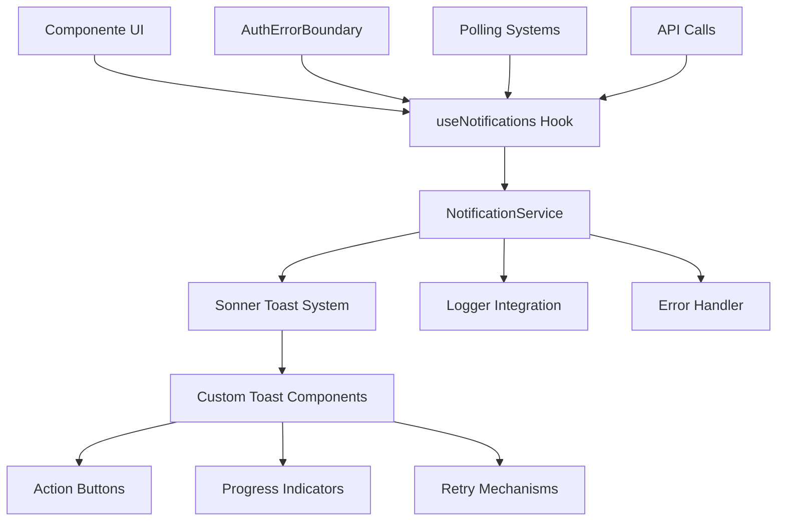
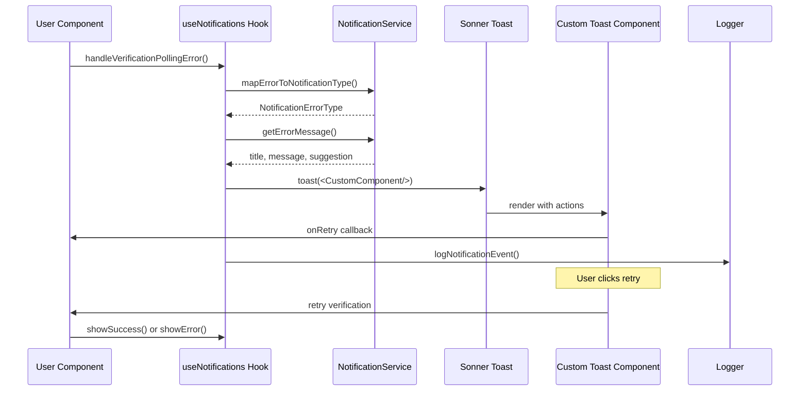
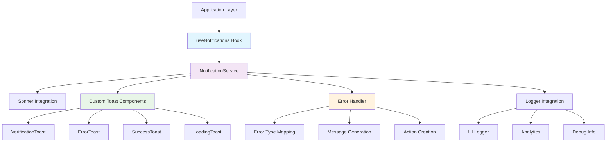
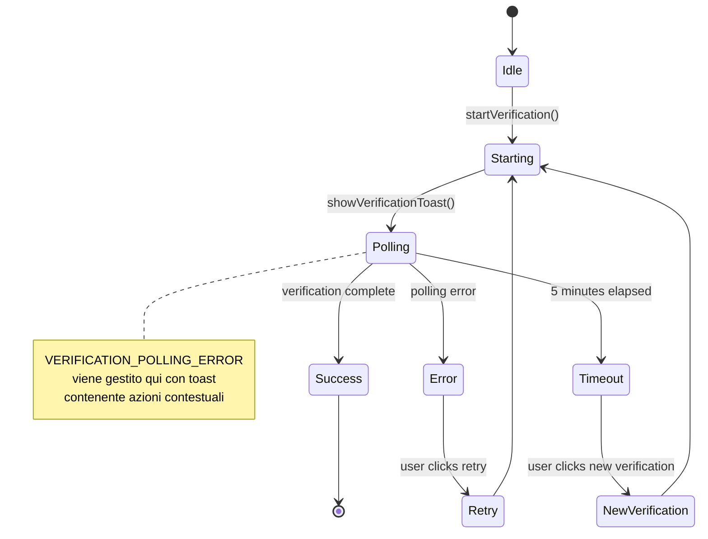

# Architettura Sistema Toast - Design Document

## 📋 Executive Summary

Questo documento definisce l'architettura completa del sistema di notifiche toast per gestire il problema `VERIFICATION_POLLING_ERROR` e migliorare l'UX complessiva dell'applicazione. Il sistema si basa su Sonner (già presente) e si integra con l'infrastruttura esistente di logging e gestione errori.

## 🎯 Obiettivi Principali

1. **Risoluzione VERIFICATION_POLLING_ERROR**: Fornire feedback visivo e azioni contestuali per errori di polling
2. **UX Migliorata**: Toast informativi con azioni dirette per gli utenti
3. **Architettura Estensibile**: Sistema modulare per diversi tipi di notifiche
4. **Integrazione Seamless**: Compatibilità con AuthErrorBoundary e sistema di logging esistente

## 🏗️ Architettura del Sistema

### Panoramica Generale



## 🔧 1. Sistema di Tipi TypeScript

### Core Types

```typescript
// src/lib/notifications/types.ts

/**
 * Tipi di notifica per categorizzazione e styling
 */
export enum NotificationType {
  SUCCESS = 'success',
  ERROR = 'error',
  WARNING = 'warning',
  INFO = 'info',
  LOADING = 'loading',
  VERIFICATION = 'verification'
}

/**
 * Tipi di errore specifici per notifiche
 */
export enum NotificationErrorType {
  // Errori di verifica
  VERIFICATION_POLLING_ERROR = 'VERIFICATION_POLLING_ERROR',
  VERIFICATION_TIMEOUT = 'VERIFICATION_TIMEOUT',
  VERIFICATION_EXPIRED = 'VERIFICATION_EXPIRED',
  NONCE_INVALID = 'NONCE_INVALID',
  
  // Errori di rete
  NETWORK_ERROR = 'NETWORK_ERROR',
  API_ERROR = 'API_ERROR',
  CONNECTIVITY_LOST = 'CONNECTIVITY_LOST',
  
  // Errori di autenticazione
  AUTH_SESSION_EXPIRED = 'AUTH_SESSION_EXPIRED',
  AUTH_UNAUTHORIZED = 'AUTH_UNAUTHORIZED',
  AUTH_TOKEN_REFRESH_FAILED = 'AUTH_TOKEN_REFRESH_FAILED',
  
  // Errori generici
  UNKNOWN_ERROR = 'UNKNOWN_ERROR',
  SERVER_ERROR = 'SERVER_ERROR'
}

/**
 * Azioni contestuali disponibili nei toast
 */
export interface NotificationAction {
  /** Etichetta del pulsante */
  label: string;
  /** Funzione da eseguire al click */
  onClick: () => void | Promise<void>;
  /** Variante visiva del pulsante */
  variant?: 'default' | 'destructive' | 'outline' | 'secondary';
  /** Icona opzionale */
  icon?: React.ComponentType<{ className?: string }>;
  /** Disabilita il pulsante */
  disabled?: boolean;
}

/**
 * Configurazione del toast
 */
export interface NotificationConfig {
  /** Durata in millisecondi (0 = infinito) */
  duration?: number;
  /** Posizione del toast */
  position?: 'top-left' | 'top-center' | 'top-right' | 'bottom-left' | 'bottom-center' | 'bottom-right';
  /** Dismissible dall'utente */
  dismissible?: boolean;
  /** Mostra progress bar per operazioni lunghe */
  showProgress?: boolean;
  /** Chiudi automaticamente al successo */
  autoCloseOnSuccess?: boolean;
  /** Riprova automaticamente */
  autoRetry?: {
    enabled: boolean;
    maxAttempts: number;
    intervalMs: number;
  };
}

/**
 * Dati del toast di notifica
 */
export interface NotificationData {
  /** ID univoco del toast */
  id: string;
  /** Tipo di notifica */
  type: NotificationType;
  /** Titolo del toast */
  title: string;
  /** Messaggio dettagliato */
  message?: string;
  /** Azioni contestuali */
  actions?: NotificationAction[];
  /** Configurazione del toast */
  config?: NotificationConfig;
  /** Metadati per tracking e debugging */
  metadata?: {
    /** Tipo di errore specifico */
    errorType?: NotificationErrorType;
    /** Context dell'operazione */
    context?: string;
    /** ID dell'operazione correlata */
    operationId?: string;
    /** Timestamp di creazione */
    timestamp: Date;
    /** Dati aggiuntivi per debugging */
    details?: Record<string, unknown>;
  };
}

/**
 * Stato del sistema di notifiche
 */
export interface NotificationState {
  /** Toast attivi */
  activeToasts: Map<string, NotificationData>;
  /** Coda delle notifiche */
  queue: NotificationData[];
  /** Configurazione globale */
  globalConfig: NotificationConfig;
  /** Statistiche per analytics */
  stats: {
    totalShown: number;
    totalDismissed: number;
    totalActioned: number;
  };
}

/**
 * Opzioni per la creazione di toast di errore
 */
export interface ErrorNotificationOptions {
  /** Tipo di errore specifico */
  errorType: NotificationErrorType;
  /** Context dell'operazione */
  context?: string;
  /** Errore originale per debugging */
  originalError?: unknown;
  /** Azioni personalizzate */
  customActions?: NotificationAction[];
  /** Configurazione specifica */
  config?: Partial<NotificationConfig>;
  /** Suggerimenti per l'utente */
  userSuggestion?: string;
}

/**
 * Risultato dell'operazione di retry
 */
export interface RetryResult {
  success: boolean;
  error?: unknown;
  retryCount: number;
  nextRetryIn?: number;
}
```

### Tipi per Polling Verification

```typescript
// src/lib/notifications/verification-types.ts

/**
 * Stati del processo di verifica
 */
export enum VerificationStatus {
  IDLE = 'idle',
  STARTING = 'starting',
  POLLING = 'polling',
  SUCCESS = 'success',
  FAILED = 'failed',
  EXPIRED = 'expired',
  CANCELLED = 'cancelled'
}

/**
 * Dati della verifica in corso
 */
export interface VerificationData {
  /** ID del canale */
  channelId: string;
  /** Nome del canale */
  channelName: string;
  /** Nonce per il polling */
  nonce: string;
  /** Stato attuale */
  status: VerificationStatus;
  /** Timestamp di inizio */
  startedAt: Date;
  /** Numero di tentativi di polling */
  pollAttempts: number;
  /** URL di deep link */
  deepLink?: string;
  /** Comando da inviare */
  command?: string;
  /** Link finale di verifica */
  link?: string;
  /** Ultimo errore */
  lastError?: unknown;
}

/**
 * Configurazione per il polling di verifica
 */
export interface VerificationPollingConfig {
  /** Intervallo di polling in ms */
  intervalMs: number;
  /** Timeout totale in ms */
  timeoutMs: number;
  /** Massimo numero di tentativi */
  maxAttempts: number;
  /** Backoff esponenziale */
  exponentialBackoff: boolean;
  /** Fattore di backoff */
  backoffFactor: number;
}
```

## 🎨 2. Architettura dei Componenti

### Custom Toast Components

```typescript
// src/components/notifications/custom-toasts/VerificationToast.tsx

import { Button } from '@/components/ui/button';
import { Progress } from '@/components/ui/progress';
import { Copy, ExternalLink, RefreshCw, X } from 'lucide-react';
import type { VerificationData } from '@/lib/notifications/verification-types';

interface VerificationToastProps {
  verification: VerificationData;
  onRetry: () => void;
  onCancel: () => void;
  onCopyCommand: () => void;
  onOpenDeepLink: () => void;
  progress?: number;
}

export function VerificationToast({
  verification,
  onRetry,
  onCancel,
  onCopyCommand,
  onOpenDeepLink,
  progress
}: VerificationToastProps) {
  const { channelName, status, command, deepLink } = verification;

  return (
    <div className="space-y-3">
      <div className="flex items-start justify-between">
        <div>
          <h4 className="font-medium">Verifica {channelName}</h4>
          <p className="text-sm text-muted-foreground">
            {status === 'polling' && 'Attendendo conferma...'}
            {status === 'failed' && 'Verifica fallita'}
            {status === 'expired' && 'Verifica scaduta'}
          </p>
        </div>
        <Button
          variant="ghost"
          size="sm"
          onClick={onCancel}
          className="h-6 w-6 p-0"
        >
          <X className="h-4 w-4" />
        </Button>
      </div>

      {progress !== undefined && (
        <Progress value={progress} className="h-2" />
      )}

      {command && (
        <div className="space-y-2">
          <p className="text-xs font-medium">Invia questo comando:</p>
          <div className="flex items-center gap-2 p-2 bg-muted rounded text-xs font-mono">
            <span className="flex-1 truncate">{command}</span>
            <Button
              variant="ghost"
              size="sm"
              onClick={onCopyCommand}
              className="h-6 w-6 p-0"
            >
              <Copy className="h-3 w-3" />
            </Button>
          </div>
        </div>
      )}

      <div className="flex gap-2">
        {deepLink && (
          <Button
            variant="outline"
            size="sm"
            onClick={onOpenDeepLink}
            className="flex-1"
          >
            <ExternalLink className="h-3 w-3 mr-2" />
            Apri {channelName}
          </Button>
        )}
        <Button
          variant="outline"
          size="sm"
          onClick={onRetry}
          className="flex-1"
        >
          <RefreshCw className="h-3 w-3 mr-2" />
          Riprova
        </Button>
      </div>
    </div>
  );
}
```

### Error Toast Component

```typescript
// src/components/notifications/custom-toasts/ErrorToast.tsx

import { Button } from '@/components/ui/button';
import { AlertCircle, RefreshCw, Home, LogOut } from 'lucide-react';
import type { NotificationErrorType } from '@/lib/notifications/types';

interface ErrorToastProps {
  title: string;
  message: string;
  errorType: NotificationErrorType;
  onRetry?: () => void;
  onGoHome?: () => void;
  onSignOut?: () => void;
  showDetails?: boolean;
  details?: Record<string, unknown>;
}

export function ErrorToast({
  title,
  message,
  errorType,
  onRetry,
  onGoHome,
  onSignOut,
  showDetails = false,
  details
}: ErrorToastProps) {
  const isAuthError = [
    'AUTH_SESSION_EXPIRED',
    'AUTH_UNAUTHORIZED',
    'AUTH_TOKEN_REFRESH_FAILED'
  ].includes(errorType);

  const isNetworkError = [
    'NETWORK_ERROR',
    'CONNECTIVITY_LOST'
  ].includes(errorType);

  return (
    <div className="space-y-3">
      <div className="flex items-start gap-3">
        <AlertCircle className="h-5 w-5 text-destructive flex-shrink-0 mt-0.5" />
        <div className="flex-1">
          <h4 className="font-medium text-destructive">{title}</h4>
          <p className="text-sm text-muted-foreground mt-1">{message}</p>
        </div>
      </div>

      {showDetails && details && (
        <details className="text-xs">
          <summary className="cursor-pointer text-muted-foreground">
            Dettagli tecnici
          </summary>
          <pre className="mt-2 p-2 bg-muted rounded text-xs overflow-auto">
            {JSON.stringify(details, null, 2)}
          </pre>
        </details>
      )}

      <div className="flex gap-2">
        {onRetry && isNetworkError && (
          <Button
            variant="outline"
            size="sm"
            onClick={onRetry}
            className="flex-1"
          >
            <RefreshCw className="h-3 w-3 mr-2" />
            Riprova
          </Button>
        )}
        
        {onGoHome && (
          <Button
            variant="outline"
            size="sm"
            onClick={onGoHome}
            className="flex-1"
          >
            <Home className="h-3 w-3 mr-2" />
            Home
          </Button>
        )}
        
        {onSignOut && isAuthError && (
          <Button
            variant="destructive"
            size="sm"
            onClick={onSignOut}
            className="flex-1"
          >
            <LogOut className="h-3 w-3 mr-2" />
            Logout
          </Button>
        )}
      </div>
    </div>
  );
}
```

## 🎣 3. Hook di Gestione - useNotifications

```typescript
// src/hooks/useNotifications.ts

import { useCallback, useRef, useState, useEffect } from 'react';
import { toast } from 'sonner';
import { useRouter } from 'next/navigation';
import { useAuthActions } from '@/components/features/auth/AuthProvider';
import { uiLogger } from '@/utils/loggers';
import type {
  NotificationData,
  NotificationType,
  NotificationErrorType,
  ErrorNotificationOptions,
  NotificationAction,
  NotificationConfig
} from '@/lib/notifications/types';
import { VerificationToast } from '@/components/notifications/custom-toasts/VerificationToast';
import { ErrorToast } from '@/components/notifications/custom-toasts/ErrorToast';

/**
 * Hook centralizzato per la gestione delle notifiche
 */
export function useNotifications() {
  const router = useRouter();
  const { signOut } = useAuthActions();
  const [activeToasts, setActiveToasts] = useState<Map<string, NotificationData>>(new Map());
  const toastIds = useRef<Map<string, string | number>>(new Map());

  /**
   * Configurazione di default per i toast
   */
  const defaultConfig: NotificationConfig = {
    duration: 5000,
    position: 'top-right',
    dismissible: true,
    showProgress: false,
    autoCloseOnSuccess: true
  };

  /**
   * Genera ID univoco per il toast
   */
  const generateToastId = useCallback(() => {
    return `toast_${Date.now()}_${Math.random().toString(36).substr(2, 9)}`;
  }, []);

  /**
   * Chiude un toast specifico
   */
  const dismissToast = useCallback((toastId: string) => {
    const sonnerToastId = toastIds.current.get(toastId);
    if (sonnerToastId) {
      toast.dismiss(sonnerToastId);
      toastIds.current.delete(toastId);
    }
    
    setActiveToasts(prev => {
      const updated = new Map(prev);
      updated.delete(toastId);
      return updated;
    });
  }, []);

  /**
   * Mostra toast di successo
   */
  const showSuccess = useCallback((
    title: string,
    message?: string,
    actions?: NotificationAction[],
    config?: Partial<NotificationConfig>
  ) => {
    const toastId = generateToastId();
    const finalConfig = { ...defaultConfig, ...config };

    const sonnerToastId = toast.success(title, {
      description: message,
      duration: finalConfig.duration,
      action: actions?.[0] ? {
        label: actions[0].label,
        onClick: actions[0].onClick
      } : undefined
    });

    toastIds.current.set(toastId, sonnerToastId);

    const notificationData: NotificationData = {
      id: toastId,
      type: NotificationType.SUCCESS,
      title,
      message,
      actions,
      config: finalConfig,
      metadata: {
        timestamp: new Date()
      }
    };

    setActiveToasts(prev => new Map(prev).set(toastId, notificationData));

    uiLogger.info('NOTIFICATION_SHOWN', 'NOTIFICATIONS', {
      type: 'success',
      title,
      toastId
    });

    return toastId;
  }, [generateToastId, defaultConfig]);

  /**
   * Mostra toast di verifica con azioni contestuali
   */
  const showVerificationToast = useCallback((
    channelName: string,
    nonce: string,
    command?: string,
    deepLink?: string,
    config?: Partial<NotificationConfig>
  ) => {
    const toastId = generateToastId();
    const finalConfig = { ...defaultConfig, duration: 0, ...config }; // Infinito di default

    const onRetry = () => {
      // Logica di retry sarà implementata nel componente chiamante
      uiLogger.info('VERIFICATION_RETRY_REQUESTED', 'NOTIFICATIONS', {
        channelName,
        nonce,
        toastId
      });
    };

    const onCancel = () => {
      dismissToast(toastId);
      uiLogger.info('VERIFICATION_CANCELLED', 'NOTIFICATIONS', {
        channelName,
        nonce,
        toastId
      });
    };

    const onCopyCommand = async () => {
      if (command) {
        try {
          await navigator.clipboard.writeText(command);
          toast.success('Comando copiato!', { duration: 2000 });
        } catch (error) {
          toast.error('Errore nel copiare il comando');
        }
      }
    };

    const onOpenDeepLink = () => {
      if (deepLink) {
        window.open(deepLink, '_blank');
      }
    };

    const sonnerToastId = toast(
      <VerificationToast
        verification={{
          channelId: nonce,
          channelName,
          nonce,
          status: 'polling',
          startedAt: new Date(),
          pollAttempts: 0,
          command,
          deepLink
        }}
        onRetry={onRetry}
        onCancel={onCancel}
        onCopyCommand={onCopyCommand}
        onOpenDeepLink={onOpenDeepLink}
      />,
      {
        duration: finalConfig.duration,
        dismissible: finalConfig.dismissible
      }
    );

    toastIds.current.set(toastId, sonnerToastId);

    const notificationData: NotificationData = {
      id: toastId,
      type: NotificationType.VERIFICATION,
      title: `Verifica ${channelName}`,
      message: 'Attendendo conferma...',
      config: finalConfig,
      metadata: {
        context: 'channel_verification',
        operationId: nonce,
        timestamp: new Date(),
        details: { channelName, nonce, command, deepLink }
      }
    };

    setActiveToasts(prev => new Map(prev).set(toastId, notificationData));

    return toastId;
  }, [generateToastId, defaultConfig, dismissToast]);

  /**
   * Mostra toast di errore con azioni contestuali
   */
  const showError = useCallback((
    title: string,
    message: string,
    options?: ErrorNotificationOptions
  ) => {
    const toastId = generateToastId();
    const finalConfig = { ...defaultConfig, duration: 0, ...options?.config }; // Infinito per errori

    const { errorType, context, originalError, customActions, userSuggestion } = options || {};

    // Azioni di default basate sul tipo di errore
    const defaultActions: NotificationAction[] = [];

    if (errorType === NotificationErrorType.VERIFICATION_POLLING_ERROR) {
      defaultActions.push({
        label: 'Riprova',
        onClick: () => {
          // La logica di retry sarà gestita dal componente chiamante
          uiLogger.info('VERIFICATION_POLLING_RETRY', 'NOTIFICATIONS', {
            toastId,
            context,
            originalError
          });
        },
        variant: 'default',
        icon: RefreshCw
      });
    }

    if (errorType === NotificationErrorType.NETWORK_ERROR) {
      defaultActions.push({
        label: 'Riprova',
        onClick: () => {
          window.location.reload();
        },
        variant: 'default'
      });
    }

    if ([
      NotificationErrorType.AUTH_SESSION_EXPIRED,
      NotificationErrorType.AUTH_UNAUTHORIZED
    ].includes(errorType as NotificationErrorType)) {
      defaultActions.push({
        label: 'Effettua Logout',
        onClick: async () => {
          try {
            await signOut();
            router.push('/login');
          } catch (error) {
            uiLogger.error('SIGNOUT_ERROR', 'NOTIFICATIONS', { error });
          }
        },
        variant: 'destructive'
      });
    }

    const actions = customActions || defaultActions;

    const sonnerToastId = toast(
      <ErrorToast
        title={title}
        message={message}
        errorType={errorType || NotificationErrorType.UNKNOWN_ERROR}
        onRetry={actions.find(a => a.label.includes('Riprova'))?.onClick}
        onGoHome={() => router.push('/')}
        onSignOut={actions.find(a => a.label.includes('Logout'))?.onClick}
        showDetails={process.env.NODE_ENV === 'development'}
        details={originalError ? { originalError, context } : undefined}
      />,
      {
        duration: finalConfig.duration,
        dismissible: finalConfig.dismissible
      }
    );

    toastIds.current.set(toastId, sonnerToastId);

    const notificationData: NotificationData = {
      id: toastId,
      type: NotificationType.ERROR,
      title,
      message,
      actions,
      config: finalConfig,
      metadata: {
        errorType,
        context,
        timestamp: new Date(),
        details: { originalError, userSuggestion }
      }
    };

    setActiveToasts(prev => new Map(prev).set(toastId, notificationData));

    // Log dell'errore
    uiLogger.error('NOTIFICATION_ERROR_SHOWN', 'NOTIFICATIONS', {
      errorType,
      title,
      context,
      toastId,
      originalError
    });

    return toastId;
  }, [generateToastId, defaultConfig, router, signOut]);

  /**
   * Gestisce specificamente il VERIFICATION_POLLING_ERROR
   */
  const handleVerificationPollingError = useCallback((
    channelName: string,
    nonce: string,
    error: unknown,
    retryFn?: () => Promise<void>
  ) => {
    const errorMessage = error instanceof Error ? error.message : 'Errore durante la verifica';
    
    return showError(
      `Errore verifica ${channelName}`,
      `${errorMessage}. La verifica potrebbe richiedere più tempo del previsto.`,
      {
        errorType: NotificationErrorType.VERIFICATION_POLLING_ERROR,
        context: 'channel_verification_polling',
        originalError: error,
        customActions: retryFn ? [{
          label: 'Riprova verifica',
          onClick: retryFn,
          variant: 'default'
        }] : undefined,
        userSuggestion: 'Verifica di aver completato l\'azione richiesta nell\'app e riprova.',
        config: {
          duration: 10000 // 10 secondi per polling errors
        }
      }
    );
  }, [showError]);

  /**
   * Cleanup automatico dei toast scaduti
   */
  useEffect(() => {
    const cleanup = setInterval(() => {
      const now = Date.now();
      setActiveToasts(prev => {
        const updated = new Map(prev);
        let hasChanges = false;

        for (const [id, notification] of updated.entries()) {
          const { config, metadata } = notification;
          if (config?.duration && config.duration > 0) {
            const elapsed = now - metadata!.timestamp.getTime();
            if (elapsed > config.duration) {
              updated.delete(id);
              toastIds.current.delete(id);
              hasChanges = true;
            }
          }
        }

        return hasChanges ? updated : prev;
      });
    }, 1000);

    return () => clearInterval(cleanup);
  }, []);

  return {
    // State
    activeToasts: Array.from(activeToasts.values()),
    
    // Actions
    showSuccess,
    showError,
    showVerificationToast,
    handleVerificationPollingError,
    dismissToast,
    
    // Utils
    dismissAll: () => {
      toast.dismiss();
      setActiveToasts(new Map());
      toastIds.current.clear();
    }
  };
}
```

## 🔧 4. Gestione Errori Specifica

### Error Handler Service

```typescript
// src/lib/notifications/error-handler.ts

import type { 
  NotificationErrorType, 
  ErrorNotificationOptions 
} from './types';

/**
 * Mappa errori comuni ai loro tipi di notifica
 */
export function mapErrorToNotificationType(error: unknown): NotificationErrorType {
  if (!error) return NotificationErrorType.UNKNOWN_ERROR;

  const errorStr = error instanceof Error ? error.message : String(error);
  const lowerError = errorStr.toLowerCase();

  // Errori di verifica
  if (lowerError.includes('nonce') && lowerError.includes('expired')) {
    return NotificationErrorType.VERIFICATION_EXPIRED;
  }
  if (lowerError.includes('nonce') && lowerError.includes('invalid')) {
    return NotificationErrorType.NONCE_INVALID;
  }
  if (lowerError.includes('verification') && lowerError.includes('timeout')) {
    return NotificationErrorType.VERIFICATION_TIMEOUT;
  }

  // Errori di rete
  if (lowerError.includes('network') || lowerError.includes('fetch')) {
    return NotificationErrorType.NETWORK_ERROR;
  }
  if (lowerError.includes('connectivity') || lowerError.includes('offline')) {
    return NotificationErrorType.CONNECTIVITY_LOST;
  }

  // Errori di auth
  if (lowerError.includes('session') && lowerError.includes('expired')) {
    return NotificationErrorType.AUTH_SESSION_EXPIRED;
  }
  if (lowerError.includes('unauthorized') || lowerError.includes('403')) {
    return NotificationErrorType.AUTH_UNAUTHORIZED;
  }
  if (lowerError.includes('token') && lowerError.includes('refresh')) {
    return NotificationErrorType.AUTH_TOKEN_REFRESH_FAILED;
  }

  // Errori server
  if (lowerError.includes('500') || lowerError.includes('server')) {
    return NotificationErrorType.SERVER_ERROR;
  }

  return NotificationErrorType.UNKNOWN_ERROR;
}

/**
 * Genera messaggi user-friendly per diversi tipi di errore
 */
export function getErrorMessage(errorType: NotificationErrorType): {
  title: string;
  message: string;
  userSuggestion?: string;
} {
  switch (errorType) {
    case NotificationErrorType.VERIFICATION_POLLING_ERROR:
      return {
        title: 'Errore durante la verifica',
        message: 'Non riusciamo a verificare lo stato della tua richiesta.',
        userSuggestion: 'Assicurati di aver completato l\'azione richiesta e riprova.'
      };

    case NotificationErrorType.VERIFICATION_TIMEOUT:
      return {
        title: 'Verifica scaduta',
        message: 'Il tempo limite per la verifica è scaduto.',
        userSuggestion: 'Avvia una nuova verifica per continuare.'
      };

    case NotificationErrorType.VERIFICATION_EXPIRED:
      return {
        title: 'Link di verifica scaduto',
        message: 'Il link di verifica non è più valido.',
        userSuggestion: 'Genera un nuovo link di verifica.'
      };

    case NotificationErrorType.NONCE_INVALID:
      return {
        title: 'Codice di verifica non valido',
        message: 'Il codice di verifica non è riconosciuto dal sistema.',
        userSuggestion: 'Avvia una nuova verifica con un codice aggiornato.'
      };

    case NotificationErrorType.NETWORK_ERROR:
      return {
        title: 'Errore di connessione',
        message: 'Non riusciamo a connetterci ai nostri server.',
        userSuggestion: 'Controlla la tua connessione internet e riprova.'
      };

    case NotificationErrorType.CONNECTIVITY_LOST:
      return {
        title: 'Connessione persa',
        message: 'La connessione internet è stata interrotta.',
        userSuggestion: 'Reconnettiti e riprova l\'operazione.'
      };

    case NotificationErrorType.AUTH_SESSION_EXPIRED:
      return {
        title: 'Sessione scaduta',
        message: 'La tua sessione è scaduta per motivi di sicurezza.',
        userSuggestion: 'Effettua nuovamente l\'accesso per continuare.'
      };

    case NotificationErrorType.AUTH_UNAUTHORIZED:
      return {
        title: 'Accesso negato',
        message: 'Non hai i permessi per eseguire questa operazione.',
        userSuggestion: 'Verifica le tue credenziali e riprova.'
      };

    case NotificationErrorType.SERVER_ERROR:
      return {
        title: 'Errore del server',
        message: 'Si è verificato un problema temporaneo sui nostri server.',
        userSuggestion: 'Riprova tra qualche minuto.'
      };

    default:
      return {
        title: 'Errore imprevisto',
        message: 'Si è verificato un errore imprevisto.',
        userSuggestion: 'Riprova o contatta il supporto se il problema persiste.'
      };
  }
}
```

## 🔗 5. Integrazione con Sistema Esistente

### Integrazione con AuthErrorBoundary

```typescript
// src/components/features/auth/AuthErrorBoundary.tsx (modifiche)

import { useNotifications } from '@/hooks/useNotifications';

// Aggiungere nel componente AuthErrorFallback:
function AuthErrorFallback({ error, resetErrorBoundary, onAuthError }: AuthErrorFallbackProps) {
  const { handleAuthError } = useNotifications();
  
  // ... existing code ...

  React.useEffect(() => {
    // Mostra toast per errori di auth invece di solo UI statica
    handleAuthError(authError, resetErrorBoundary);
  }, [authError, handleAuthError, resetErrorBoundary]);

  // ... rest of component
}
```

### Integrazione con Logger

```typescript
// src/lib/notifications/logger-integration.ts

import { uiLogger } from '@/utils/loggers';
import type { NotificationData } from './types';

/**
 * Logga eventi di notifiche per analytics e debugging
 */
export function logNotificationEvent(
  event: 'shown' | 'dismissed' | 'action_clicked' | 'expired',
  notification: NotificationData,
  additionalData?: Record<string, unknown>
) {
  uiLogger.info(`NOTIFICATION_${event.toUpperCase()}`, 'NOTIFICATIONS', {
    notificationId: notification.id,
    type: notification.type,
    title: notification.title,
    errorType: notification.metadata?.errorType,
    context: notification.metadata?.context,
    timestamp: new Date().toISOString(),
    ...additionalData
  });
}

/**
 * Logga metriche di performance per le notifiche
 */
export function logNotificationMetrics(metrics: {
  totalShown: number;
  totalDismissed: number;
  totalActioned: number;
  averageDisplayTime: number;
}) {
  uiLogger.info('NOTIFICATION_METRICS', 'NOTIFICATIONS', {
    ...metrics,
    timestamp: new Date().toISOString()
  });
}
```

## 🎛️ 6. API Design

### Notification Service API

```typescript
// src/lib/notifications/service.ts

export class NotificationService {
  private static instance: NotificationService;
  private config: NotificationConfig;

  static getInstance(): NotificationService {
    if (!NotificationService.instance) {
      NotificationService.instance = new NotificationService();
    }
    return NotificationService.instance;
  }

  /**
   * API di alto livello per mostrare notifiche di verifica
   */
  async showVerificationPollingError(
    channelName: string,
    nonce: string,
    error: unknown,
    retryCallback?: () => Promise<void>
  ): Promise<string> {
    const errorType = mapErrorToNotificationType(error);
    const { title, message, userSuggestion } = getErrorMessage(errorType);

    return this.showError(title, message, {
      errorType: NotificationErrorType.VERIFICATION_POLLING_ERROR,
      context: 'verification_polling',
      originalError: error,
      userSuggestion,
      customActions: retryCallback ? [{
        label: 'Riprova verifica',
        onClick: retryCallback,
        variant: 'default'
      }] : undefined
    });
  }

  /**
   * API per timeout di verifica
   */
  async showVerificationTimeout(
    channelName: string,
    nonce: string,
    startNewVerification: () => Promise<void>
  ): Promise<string> {
    return this.showError(
      'Verifica scaduta',
      `La verifica di ${channelName} è scaduta dopo 5 minuti.`,
      {
        errorType: NotificationErrorType.VERIFICATION_TIMEOUT,
        context: 'verification_timeout',
        customActions: [{
          label: 'Nuova verifica',
          onClick: startNewVerification,
          variant: 'default'
        }],
        config: {
          duration: 0, // Resta aperto finché l'utente non agisce
          autoRetry: {
            enabled: false,
            maxAttempts: 0,
            intervalMs: 0
          }
        }
      }
    );
  }
}
```

## ⚙️ 7. Sistema di Configurazione

```typescript
// src/lib/notifications/config.ts

/**
 * Configurazione globale per il sistema di notifiche
 */
export const NOTIFICATION_CONFIG = {
  // Configurazioni per tipo
  typeDefaults: {
    [NotificationType.SUCCESS]: {
      duration: 4000,
      position: 'top-right' as const,
      dismissible: true
    },
    [NotificationType.ERROR]: {
      duration: 0, // Infinito
      position: 'top-right' as const,
      dismissible: true
    },
    [NotificationType.WARNING]: {
      duration: 8000,
      position: 'top-right' as const,
      dismissible: true
    },
    [NotificationType.INFO]: {
      duration: 6000,
      position: 'top-right' as const,
      dismissible: true
    },
    [NotificationType.LOADING]: {
      duration: 0,
      position: 'top-right' as const,
      dismissible: false
    },
    [NotificationType.VERIFICATION]: {
      duration: 0, // Infinito finché non completata
      position: 'top-right' as const,
      dismissible: true
    }
  },

  // Configurazioni per errori specifici
  errorDefaults: {
    [NotificationErrorType.VERIFICATION_POLLING_ERROR]: {
      duration: 10000,
      autoRetry: {
        enabled: true,
        maxAttempts: 3,
        intervalMs: 5000
      }
    },
    [NotificationErrorType.VERIFICATION_TIMEOUT]: {
      duration: 0,
      autoRetry: {
        enabled: false,
        maxAttempts: 0,
        intervalMs: 0
      }
    },
    [NotificationErrorType.NETWORK_ERROR]: {
      duration: 8000,
      autoRetry: {
        enabled: true,
        maxAttempts: 2,
        intervalMs: 3000
      }
    },
    [NotificationErrorType.AUTH_SESSION_EXPIRED]: {
      duration: 0,
      autoRetry: {
        enabled: false,
        maxAttempts: 0,
        intervalMs: 0
      }
    }
  },

  // Limiti del sistema
  limits: {
    maxActiveToasts: 5,
    maxQueueSize: 10,
    cleanupInterval: 30000 // 30 secondi
  },

  // Configurazioni di sviluppo
  development: {
    showDetailedErrors: true,
    logAllEvents: true,
    debugMode: true
  },

  // Configurazioni di produzione
  production: {
    showDetailedErrors: false,
    logAllEvents: false,
    debugMode: false
  }
} as const;
```

## 📊 8. Diagrammi dell'Architettura

### Flusso di Gestione Errori



### Architettura dei Componenti



### Flusso di Verifica con Toast



## 📝 9. Esempi di Utilizzo

### Caso d'uso: VERIFICATION_POLLING_ERROR

```typescript
// In ChannelVerification.tsx
import { useNotifications } from '@/hooks/useNotifications';

export default function ChannelVerification() {
  const { handleVerificationPollingError, showVerificationToast } = useNotifications();

  const startPolling = (channelId: string, nonce: string) => {
    // Mostra toast di verifica in corso
    const toastId = showVerificationToast(
      getChannelName(channelId),
      nonce,
      channelStates[channelId].command,
      channelStates[channelId].deepLink
    );

    const interval = setInterval(async () => {
      try {
        const response = await fetch(`/api/link/status/${nonce}`);
        const data = await response.json();

        if (!response.ok) {
          throw new Error(data.error || "Failed to check verification status");
        }

        if (data.status === "done") {
          // Successo - chiudi toast di verifica e mostra successo
          dismissToast(toastId);
          showSuccess(
            'Verifica completata!',
            `${getChannelName(channelId)} è stato collegato con successo.`
          );
          clearInterval(interval);
          updateChannelState(channelId, { status: "done", link: data.link });
        }
      } catch (error) {
        // VERIFICATION_POLLING_ERROR - mostra toast con azioni
        clearInterval(interval);
        dismissToast(toastId);
        
        handleVerificationPollingError(
          getChannelName(channelId),
          nonce,
          error,
          // Retry function
          async () => {
            // Riavvia il polling
            startPolling(channelId, nonce);
          }
        );
        
        updateChannelState(channelId, {
          status: "error",
          error: error instanceof Error ? error.message : "Verification failed"
        });
      }
    }, 3000);
  };
}
```

### Caso d'uso: Timeout di Verifica

```typescript
// Gestione del timeout con toast personalizzato
const handleVerificationTimeout = useCallback((channelId: string, channelName: string) => {
  const { showError } = useNotifications();
  
  showError(
    'Verifica scaduta',
    `La verifica di ${channelName} è scaduta dopo 5 minuti. Questo è normale per motivi di sicurezza.`,
    {
      errorType: NotificationErrorType.VERIFICATION_TIMEOUT,
      context: 'verification_timeout',
      customActions: [{
        label: 'Inizia nuova verifica',
        onClick: async () => {
          // Reset stato e riavvia verifica
          updateChannelState(channelId, { status: "idle" });
          await startVerification(channelId);
        },
        variant: 'default'
      }, {
        label: 'Annulla',
        onClick: () => {
          updateChannelState(channelId, { status: "idle" });
        },
        variant: 'outline'
      }],
      config: {
        duration: 0, // Resta aperto finché l'utente non agisce
        dismissible: true
      }
    }
  );
}, []);
```

## 🚀 10. Piano di Implementazione

### Fase 1: Fondamenta (1-2 giorni)
- [ ] Creare sistema di tipi TypeScript
- [ ] Implementare hook useNotifications base
- [ ] Creare componenti toast personalizzati
- [ ] Testare integrazione con Sonner

### Fase 2: Gestione Errori (1-2 giorni)
- [ ] Implementare error handler service
- [ ] Creare mappatura errori specifici
- [ ] Aggiungere messaggi localizzati
- [ ] Integrare con sistema di logging

### Fase 3: Integrazione (1 giorno)
- [ ] Aggiornare ChannelVerification.tsx
- [ ] Integrare con AuthErrorBoundary
- [ ] Aggiornare componenti esistenti
- [ ] Testing e debugging

### Fase 4: Miglioramenti (1 giorno)
- [ ] Aggiungere configurazioni avanzate
- [ ] Implementare auto-retry
- [ ] Aggiungere analytics
- [ ] Ottimizzazioni performance

## 🎯 Risultati Attesi

1. **UX Migliorata**: Gli utenti riceveranno feedback immediato e azioni contestuali per risolvere problemi
2. **Riduzione Supporto**: Meno ticket di supporto grazie a messaggi chiari e azioni self-service
3. **Maggiore Completamento**: Aumento del tasso di completamento delle verificazioni
4. **Debugging Facilitato**: Logging strutturato per identificare e risolvere problemi rapidamente
5. **Architettura Scalabile**: Sistema estensibile per nuovi tipi di notifiche e casi d'uso

## 🔧 Note Tecniche

- **Compatibilità**: Mantiene piena compatibilità con l'sistema esistente
- **Performance**: Gestione efficiente della memoria con cleanup automatico
- **Accessibilità**: Supporto per screen reader e navigazione da tastiera
- **Internazionalizzazione**: Pronto per localizzazione in multiple lingue
- **Testing**: Struttura testabile con clear separation of concerns

---

*Questo documento rappresenta la specifica completa per l'implementazione del sistema di toast. L'architettura è progettata per essere modulare, estensibile e facilmente integrabile con il sistema esistente.*