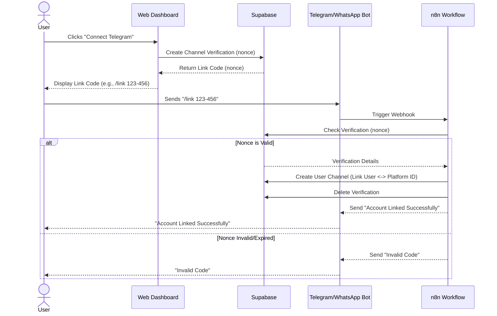
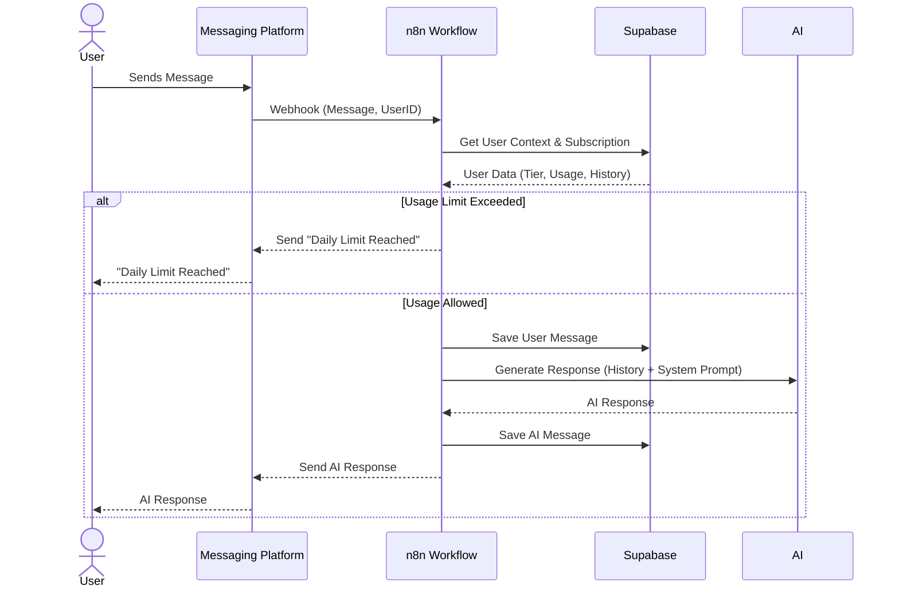
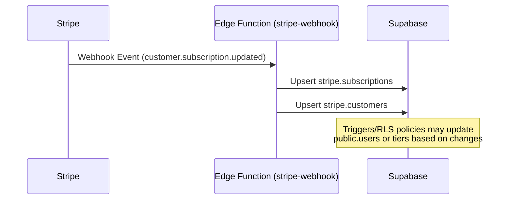

# Entity Lifecycle Documentation

This document describes the lifecycle of the core entities in the AnthonChat architecture and provides sequential diagrams for key workflows.

## Core Entities

### 1. User

The central entity representing a human interacting with the system.

-   **Creation**: Created via the web interface (sign-up) or implicitly via channel linking (if supported).
-   **States**:
    -   `Active`: Standard state.
    -   `Inactive`: Soft deleted or banned.
-   **Key Relationships**: Has many `UserChannels`, one `Subscription`.

### 2. User Channel

Represents a link between a `User` and a messaging platform (e.g., WhatsApp, Telegram).

-   **Creation**: Created when a user successfully links their messaging account using a verification code.
-   **States**:
    -   `Unverified`: Initial state during linking (stored in `channel_verifications`).
    -   `Verified`: Active link stored in `user_channels`.
-   **Key Data**: Stores the platform-specific ID (e.g., phone number, chat ID).

### 3. Channel Verification

A temporary entity used during the account linking process.

-   **Creation**: Generated when a user requests a link code on the web dashboard.
-   **Lifecycle**:
    -   Created with a `nonce` and `expires_at` timestamp.
    -   Consumed when the user sends the code to the bot.
    -   Deleted/Expired after use or timeout.

### 4. Subscription

Manages the user's access level and limits.

-   **Source of Truth**: Stripe (synced to `stripe.subscriptions` table).
-   **States**: `active`, `past_due`, `canceled`, `incomplete`.
-   **Impact**: Determines rate limits (messages per day) and feature access.

---

## Workflows & Diagrams

### 1. Account Linking Flow

This flow illustrates how a user connects their Telegram/WhatsApp account to their web dashboard.

### 2. Message Processing Loop

The core loop for handling user messages, enforcing limits, and generating AI responses.

### 3. Subscription Sync (Stripe)

How subscription status updates propagate from Stripe to the application.

